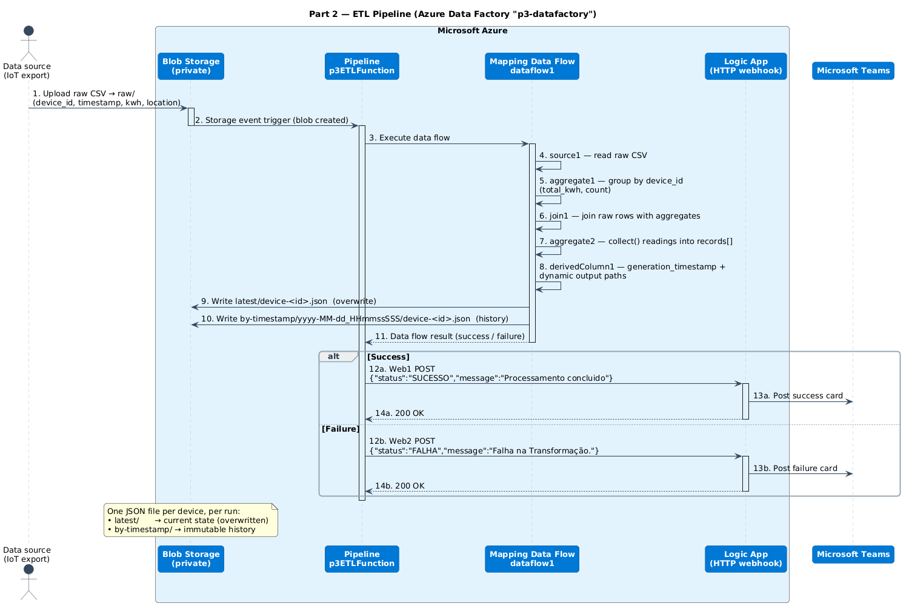
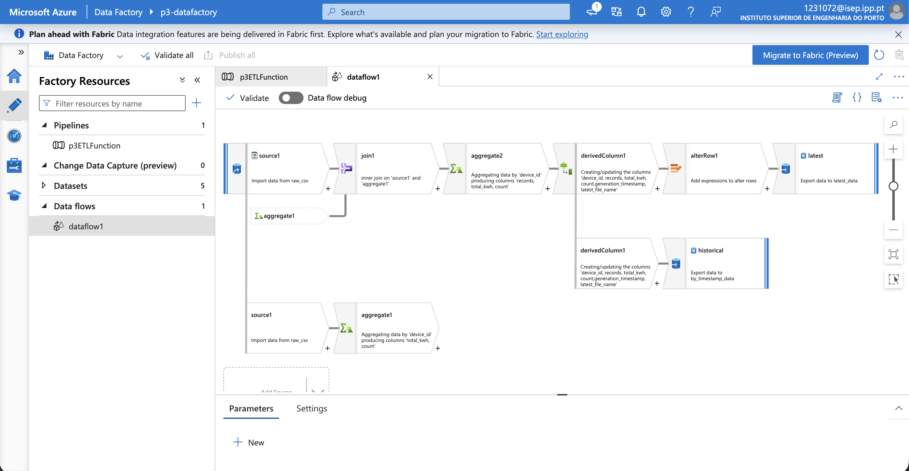
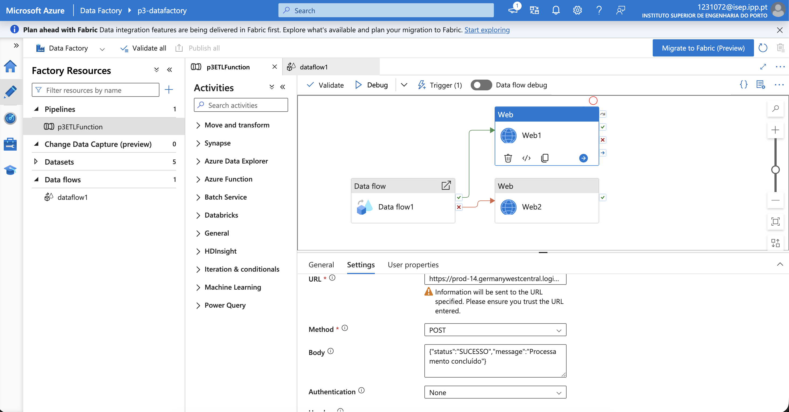
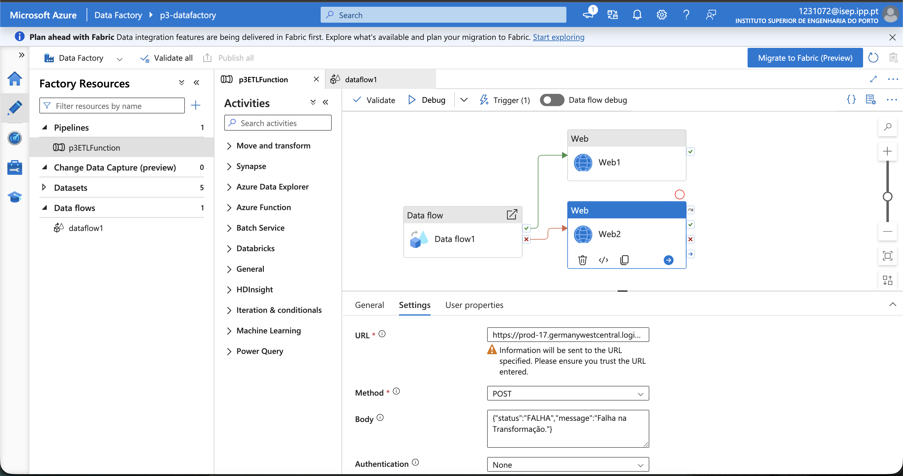

# IoT Energy Data Processing Pipeline

This repository contains the documentation and logic for an ETL (Extract, Transform, Load) pipeline built using **Azure Data Factory (ADF)**. The pipeline processes raw IoT energy consumption data and generates both real-time "Latest" state files and a granular historical archive.

##  Pipeline Overview

The pipeline is designed to handle energy meter readings from multiple devices. It transforms flat CSV data into structured JSON objects, calculating aggregates and organizing files by device ID and execution timestamps.

### Key Features:
* **Event-Driven**: Triggered automatically upon file upload to the `raw/` directory.
* **Dynamic Partitioning**: Generates individual JSON files for each unique `device_id`.
* **Immutable History**: Saves every execution in a unique timestamped folder (down to the millisecond) to prevent data loss or overwriting.
* **Aggregated Summaries**: Includes total kWh and record counts directly in the output JSON.
* **Automated Notifications**: A **Web activity** in the orchestration pipeline posts to a webhook (**Azure Logic App** → **Microsoft Teams**) with a separate branch for success and failure.

---

##  Data Flow Architecture

The Data Flow follows a "Fan-out" pattern to calculate aggregates and then joins them back to the granular records.



Source: [`Sequence-diagram.puml`](Sequence-diagram.puml).

### Transformation Steps:
1. **Source (`source1`)**: Reads raw CSV files from the landing zone.
2. **Aggregate (`aggregate1`)**: Groups data by `device_id` to calculate `total_kwh` and `count`.
3. **Join (`join1`)**: Performs an Inner Join between the raw stream and the aggregates using `device_id` as the key.
4. **JSON Structuring (`aggregate2`)**: Uses the `collect()` function to nest individual meter readings into a `records` array.
5. **Path Generation (`derivedColumn1`)**:
    - Generates `generation_timestamp` using `currentUTC()`.
    - Creates dynamic paths:
        - **Latest**: `latest/device-<id>.json`
        - **Historical**: `by-timestamp/yyyy-MM-dd_HHmmssSSS/device-<id>.json`
6. **Sinks**:
    - **Latest Sink**: Updates the current state (Overwrites enabled).
    - **Historical Sink**: Appends to the archive (Overwrite disabled, unique paths enforced).

---

## Pipeline in Azure Data Factory (Screenshots)

These screenshots are taken from the `p3-datafactory` Data Factory.

### Data flow (`dataflow1`)

The mapping data flow that transforms the raw CSV into the `latest` and `historical` outputs.
The graph shows the full chain: **source → join → aggregate → derivedColumn → alterRow** into
the **`latest`** sink, with a parallel branch writing the **`historical`** sink.



### Orchestration pipeline (`p3ETLFunction`)

The pipeline runs the data flow and then branches on its outcome. A **Web activity** POSTs a
JSON payload to a webhook (an Azure Logic App HTTP trigger), which forwards the message to the
**Microsoft Teams** channel.

**Success path** — on the data flow's success output, `Web1` POSTs
`{"status":"SUCESSO","message":"Processamento concluido"}`:



**Failure path** — on the data flow's failure output, `Web2` POSTs
`{"status":"FALHA","message":"Falha na Transformação."}`:



---

## Notification Details

The notification is sent by a **Web activity** in the orchestration pipeline (one branch for
success, one for failure), using:

- **Method**: `POST`
- **URL**: an Azure Logic App HTTP-trigger webhook (which relays to Microsoft Teams)
- **Authentication**: None (the webhook URL is the secret; keep it out of source — store it
  as a pipeline parameter / linked-service setting)

**Payloads**

| Branch | Body |
|--------|------|
| Success | `{"status":"SUCESSO","message":"Processamento concluido"}` |
| Failure | `{"status":"FALHA","message":"Falha na Transformação."}` |

## ️Technical Specifications

### Data Schema
| Column | Type | Description |
| :--- | :--- | :--- |
| `device_id` | String | Unique identifier for the energy meter. |
| `timestamp` | String | ISO-8601 timestamp of the reading. |
| `kwh` | Double | Energy consumption value. |
| `location` | String | Physical location of the device. |

### Historical Path Expression
To ensure no files are overwritten in the history, the following expression is used:
```javascript
concat('by-timestamp/', toString(currentUTC(), 'yyyy-MM-dd_HHmmssSSS'), '/device-', toString(device_id), '.json')
```

