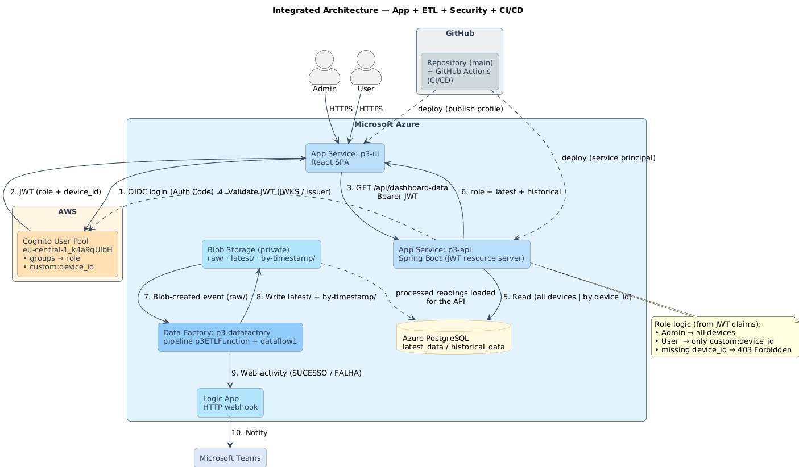
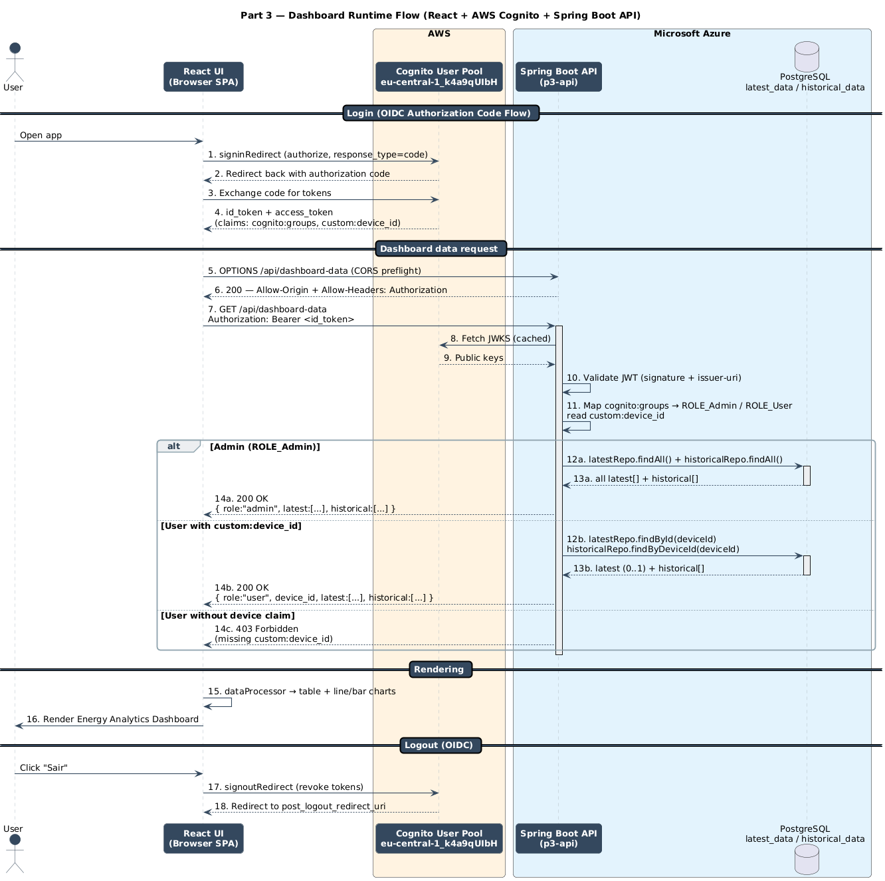

# Part 3 — Security, IAM & Monitoring

This document describes the secured system architecture and the end-to-end flow between the
**React UI**, the **Spring Boot API**, **AWS Cognito (OIDC)**, and the **Data Layer**
(processed readings). It is the deliverable for **Project Part 3**, which adds identity,
role separation, and access control on top of Parts 1 and 2.

For full credential setup (Cognito groups, the `custom:device_id` attribute, secrets), see
[`../CONFIGURATION.md`](../CONFIGURATION.md).

---

## 1. Architecture Overview

The application is split into independently deployed components:

- **Frontend (UI)**: React single-page app (SPA) running in the browser
- **Backend (API)**: Spring Boot REST API (OAuth2 resource server)
- **Authentication**: AWS Cognito (OIDC Authorization Code flow)
- **Data Layer**: processed readings (`latest` + `historical`) the API returns

### Components Overview

| Component | Technology | Purpose |
|---|---|---|
| **Frontend (UI)** | React | Renders dashboards, handles authentication redirects, calls the API with JWTs. |
| **Backend (API)** | Spring Boot (Java) | Validates JWT, applies role-based logic, fetches processed data, returns the dashboard payload. |
| **Auth (IdP)** | AWS Cognito (OIDC) | Issues tokens used by the UI and validated by the API (`cognito:groups` → role, `custom:device_id` → data filter). |
| **Data Layer** | Processed readings | Source of `latest` and `historical` readings returned by the API. |

> Note: dashboard reads come from the processed readings stored for each device; role and
> device scoping are enforced server-side from JWT claims.

---

## 2. Diagrams

### 2.1 Architecture Diagram

- PlantUML source: `docs/Part_3/arch-diagram.puml`
- Rendered image: `docs/Part_3/arch-diagram.png`

### 2.2 Dashboard Sequence Diagram (React + Cognito + API + Processed container)

- PlantUML source: `docs/Part_3/sequence-diagram.puml`
- Rendered image: `docs/Part_3/sequence-diagram.png`

---

## 3. Dashboard Flow (UI → API)

This section documents the full end-to-end flow for the **Dashboard**, aligned with the sequence diagram.

### 3.1 Authentication (OIDC / Cognito)

#### 3.1.1 Login (Authorization Code Flow)
1. The user opens the UI.
2. The UI redirects the user to Cognito to authenticate.
3. Cognito redirects back with an authorization code.
4. The UI exchanges the code for tokens (commonly `id_token` and `access_token`).

#### 3.1.2 Calling the API
The UI calls the API using:
- `Authorization: Bearer <jwt>`

The API validates the JWT and extracts:
- user identity claims
- authorities/roles
- device identifier claim (for standard users), if applicable

---

### 3.2 Dashboard API Endpoint

#### 3.2.1 Request
- **Method**: `GET`
- **Path**: `/api/dashboard-data`
- **Headers**:
  - `Authorization: Bearer <jwt>`

#### 3.2.2 Response (expected structure)
The API returns a consolidated JSON payload:

- `role`: `"admin"` or `"user"`
- `latest`: list (can be empty)
- `historical`: list
- when `role = "user"`:
  - `device_id`

---

### 3.3 Backend Logic (aligned with diagram)

1. **JWT validation**: verify signature/issuer against the Cognito JWKS.
2. **Role check** (from the `cognito:groups` claim, mapped to `ROLE_Admin` / `ROLE_User`):
  - **Admin**: fetch `latest` and `historical` for all devices.
  - **Standard user**: extract `custom:device_id` from token claims.
    - If missing → return **403 Forbidden**
    - If present → fetch `latest` and `historical` filtered by that `device_id`.
3. Return `200 OK` with the dashboard payload.

---

### 3.4 Data Layer (Processed readings)

The API reads dashboard data from the **processed** readings:
- **Latest** readings (most recent per device)
- **Historical** readings (time series)

Filtering behavior:
- Admin: unfiltered (all devices)
- User: filtered by `device_id`

---

### 3.5 Frontend Rendering

After receiving the API response, the UI:
1. transforms raw arrays into table/chart-friendly structures
2. renders:
  - latest table
  - line chart (historical trend)
  - bar charts (totals/averages)
3. shows appropriate states:
  - loading (auth or data)
  - error (network/auth/forbidden)
  - ready state

---

## 4. Common Failure Modes (quick)

- **401 Unauthorized**: missing/expired/invalid token, JWT validation mismatch
- **403 Forbidden**: user token missing required `device_id` claim or insufficient role
- **CORS blocked**: origin/headers not allowed (preflight fails)

---