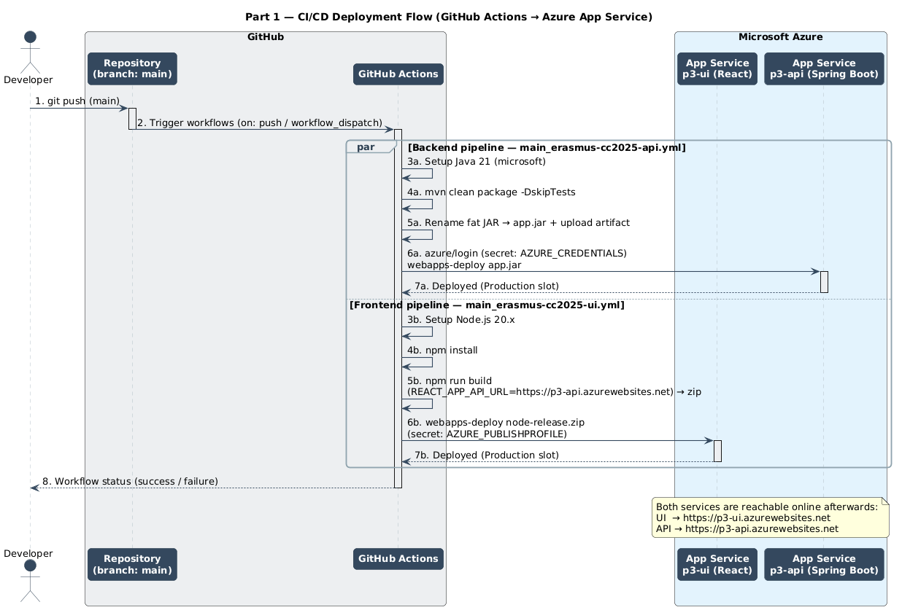

# Part 1 — Cloud-Deployed Data Application

This document covers **Project Part 1**: the frontend + backend web application, its REST
API, and the automated deployment to Azure App Service. (Identity/security is added in
Part 3 — see [`Part_3/documentation.md`](Part_3/documentation.md); the ETL pipeline is
Part 2 — see [`Part_2/documentation.md`](Part_2/documentation.md).)

---

## 1. Architecture overview

The application is split into independently deployed services, each on its own **Azure App
Service**:

| Component | Technology | Azure Service | Purpose |
|-----------|------------|---------------|---------|
| **Frontend (UI)** | React 19 SPA | `p3-ui` | Serves the static SPA; calls the API and renders tables/charts. |
| **Backend (API)** | Spring Boot 3.5.7 (Java 21) | `p3-api` | Exposes REST endpoints, applies business/role logic, persists data. |
| **Database (DB)** | PostgreSQL | `erasmus-api-db` | Stores `latest_data` and `historical_data` (and `items`). |

The frontend and backend are deployed separately and communicate over HTTPS. The API base
URL is injected into the React build at deploy time (`REACT_APP_API_URL`).

---

## 2. REST API

The application exposes a REST API under `/api`. The Part 1 baseline includes data-retrieval
and CRUD endpoints; Part 3 puts them behind JWT authentication and role checks.

| Method | Path | Description |
|--------|------|-------------|
| `GET` | `/api/dashboard-data` | Consolidated dashboard payload (role-scoped — see Part 3). |
| `GET` | `/api/data/history/all` | All historical readings (admin view). |
| `POST` | `/api/data/history/by-devices` | Historical readings for a list of device IDs. |
| `GET` | `/api/items` | List items. |
| `POST` | `/api/items` | Create an item. |
| `GET` | `/api/items/{id}` | Fetch one item. |
| `PUT` | `/api/items/{id}` | Update an item. |
| `DELETE` | `/api/items/{id}` | Delete an item. |

Interactive documentation is available via Swagger UI at `/swagger-ui/index.html`
(configured in `OpenApiConfig.java` with a Bearer-JWT security scheme).

---

## 3. Frontend

A React single-page app under `src/main/resources/static`. It uses:
- `react-oidc-context` for the Cognito login flow (Part 3),
- `recharts` for the dashboard charts,
- `react-router-dom` for routing.

The dashboard (`components/Dashboard.js`) fetches `/api/dashboard-data`, then transforms the
response (`utils/dataProcessor.js`) into a latest-readings table, a consumption trend line
chart, and bar charts for totals and averages. The API base URL resolves to
`http://localhost:8080` on localhost, otherwise `process.env.REACT_APP_API_URL`.

---

## 4. Configuration (Part 1)

Backend configuration is environment-variable driven (`application.properties`), so no
secrets live in source:

| Setting | Source | Purpose |
|---------|--------|---------|
| `AZURE_DB_URL` / `AZURE_DB_USER` / `AZURE_DB_PASSWORD` | Azure App Service settings | PostgreSQL connection (password is a secret). |
| `app.frontend.url` (`APP_FRONTEND_URL`) | Azure App Service settings | Allowed CORS origin for the UI. |
| `spring.jpa.hibernate.ddl-auto=update` | `application.properties` | Auto-creates/updates tables on boot. |

CORS is configured in `SecurityConfig.java` to allow the UI origin (and `localhost:3000`)
with the `Authorization` and `Content-Type` headers. Full credential setup is in
[`CONFIGURATION.md`](CONFIGURATION.md).

---

## 5. Deployment & CI/CD

Both services deploy automatically via **GitHub Actions** on every push to `main`:

- **API** — `.github/workflows/main_erasmus-cc2025-api.yml`: builds the Spring Boot fat JAR
  with Maven (Java 21), renames it to `app.jar`, and deploys it to App Service `p3-api` using
  the `AZURE_CREDENTIALS` service principal.
- **UI** — `.github/workflows/main_erasmus-cc2025-ui.yml`: runs `npm run build` (injecting
  `REACT_APP_API_URL`), zips the `build/` output, and deploys it to App Service `p3-ui` using
  the `AZURE_PUBLISHPROFILE` secret.

This satisfies the Part 1 requirement that every commit triggers an automatic build and
deployment of both frontend and backend.

### Deployment sequence

Source: [`cicd-sequence.puml`](cicd-sequence.puml).
